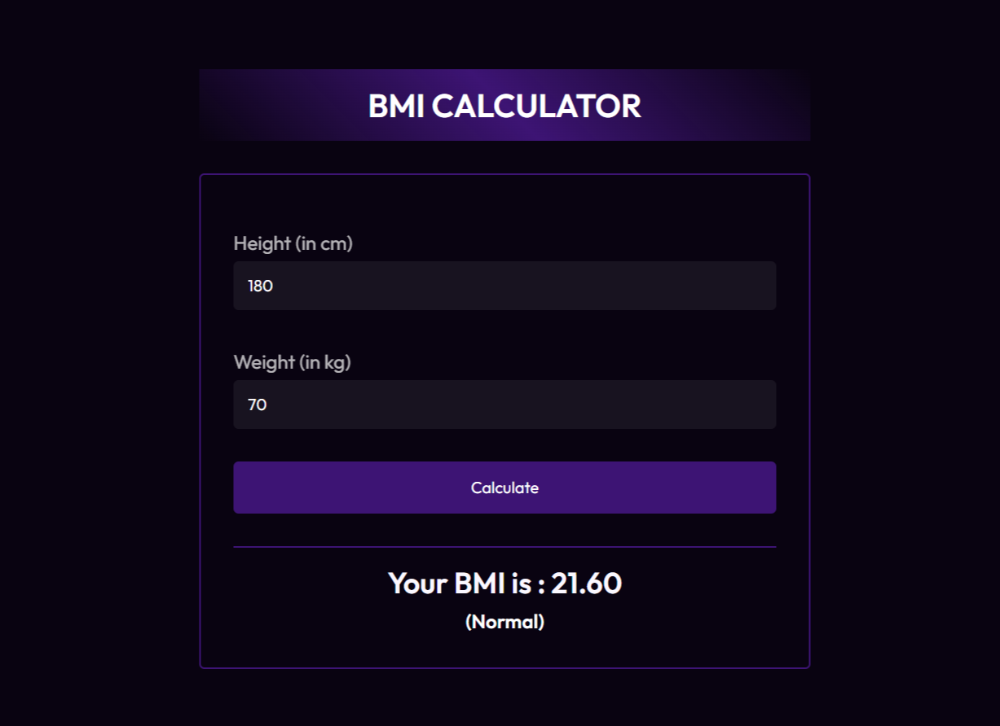

# BMI Calculator

Welcome to the BMI Calculator repository! This project is a JavaScript-based web application designed to calculate Body Mass Index (BMI) and provide a message based on the result. Built with HTML, CSS, and JavaScript, it features a modern UI design for an intuitive and user-friendly experience.

## Preview



## Features

- **BMI Calculation:** Enter height and weight to calculate BMI instantly.
- **Result Message:** Receive a personalized message based on the calculated BMI.
- **Modern UI Design:** Sleek layout and visually appealing design for an enjoyable user interface.

## Getting Started

To run the BMI Calculator locally, follow these steps:

1. Clone the repository to your local machine:

   ```bash
   git clone https://github.com/Devsethi3/BMI-Calculator.git
   ```

2. Open the `index.html` file in your preferred web browser.

## Usage

1. Enter your height in meters and weight in kilograms.
2. Click the "Calculate BMI" button.
3. View the calculated BMI and the associated result message.

## Customization

Feel free to customize this project to fit your preferences. Update styles, colors, and layout in the HTML and CSS files. You can also extend the functionality to include additional features or customization options.

## Contributing

If you'd like to contribute to this project, please follow these steps:

1. Fork the repository.
2. Create a new branch for your feature or improvement.
3. Make your changes and commit them with descriptive messages.
4. Push your changes to your forked repository.
5. Open a pull request to merge your changes into the main branch.

Explore the BMI Calculator, calculate your BMI with ease, and consider contributing to its development. Thank you for checking out the repository!